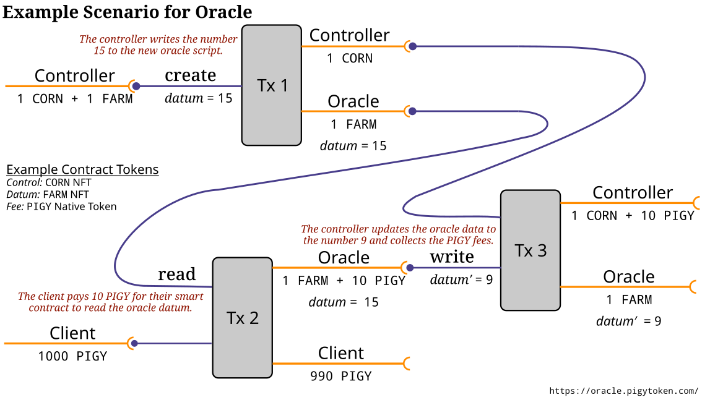

Using the PIGY Oracle Service
=============================

The PIGY Oracle is a community-driven, minimal-cost oracle to benefit SPOs. See https://oracle.pigytoken.com/ for details.

This oracle service (a Plutus smart contract) began running on the Cardano MainNet immediately after the Alonzo HFC event; it posts daily updates of its datafeeds at 12:00 UTC. To the extent feasible, we will freely add community-nominated data sources to the PIGY Oracle. We have completely open-sourced the on- and off-chain code so that the Cardano community can easily deploy their own customized oracles for whatever data feeds they wish.

*   [Data Format](#data-format)
*   [Technical Details](#technical-details)
*   [Reading the Oracle Datum](#reading-the-oracle-datum)
*   [Risks](#risks)
*   [Disclaimer](ipfs/disclaimer.txt)

Please feel free to [contact us](mailto:code@functionally.io) with questions, concerns, requests for assistance, or Plutus consultation. In particular, we welcome collaboration, the nomination of new data feeds to include in the oracle, additional deployments of this oracle, deployments of complementary oracles, and decentralization efforts.

Data Format
-----------

In addition to being posted on the blockchain as eUTxO data at the smart-contract address (on `mainnet` at [`addr1w83xtd6pekdv93xkj4qz77a5edyuhcxeuvlwex3xm0afukgj73l65`](https://cardanoscan.io/address/addr1w83xtd6pekdv93xkj4qz77a5edyuhcxeuvlwex3xm0afukgj73l65)), for convenience the data is also posted in the eUTxO as metadata with tag `247428` and also at [ipns://k51qzi5uqu5dgsw6m8og2thi7kzs9lxjb7w0y4r20u0lkrm92vuqja644v6ray](http://gateway.pinata.cloud/ipns/k51qzi5uqu5dgsw6m8og2thi7kzs9lxjb7w0y4r20u0lkrm92vuqja644v6ray).

The service currently posts some cryptocurrency prices, precious metal prices, and an interest rate. Here is [an example](https://cardanoscan.io/transaction/914b2aabdfdeaae0f9399526439ccd6c5d47efd390839e09cff868faba7ec2e5?tab=metadata):

    {
      "disclaimer": "ipfs://QmccBPKZqh9BJTJpC8oM6rc4gBrpcVXqcixX9KCsE6yDKd",
      "oracle": "https://oracle.pigytoken.com",
      "timestamp": "2021-09-18T18:26:21+00:00",
      "data": {
        "nyfed": {
          "source": "https://www.newyorkfed.org",
          "symbols": {
            "SOFR": { "date": "2021-09-16", "value": 5, "scale": 100, "unit": "%", "url": "https://markets.newyorkfed.org/api/rates/secured/sofr" }
          }
        },
        "coingecko": {
          "source": [
            "Data provided by CoinGecko",
            "https://www.coingecko.com/api"
          ],
          "symbols": {
            "ADAUSD": { "value":       238, "scale":       100, "unit": "USD/ADA" },
            "ADAEUR": { "value":       203, "scale":       100, "unit": "EUR/ADA" },
            "ADAGBP": { "value":       173, "scale":       100, "unit": "GBP/ADA" },
            "ADAIDR": { "value":     33894, "scale":         1, "unit": "IDR/ADA" },
            "ADAJPY": { "value":     26123, "scale":       100, "unit": "JPY/ADA" },
            "ADABTC": { "value":      4905, "scale": 100000000, "unit": "BTC/ADA" },
            "ADAETH": { "value":     68771, "scale": 100000000, "unit": "ETH/ADA" },
            "BTCUSD": { "value":     48435, "scale":         1, "unit": "USD/BTC" },
            "BTCEUR": { "value":     41306, "scale":         1, "unit": "EUR/BTC" },
            "BTCGBP": { "value":     35250, "scale":         1, "unit": "GBP/BTC" },
            "BTCIDR": { "value": 690840384, "scale":         1, "unit": "IDR/BTC" },
            "BTCJPY": { "value":   5324373, "scale":         1, "unit": "JPY/BTC" },
            "BTCETH": { "value":  14026648, "scale":   1000000, "unit": "ETH/BTC" },
            "ETHUSD": { "value":    345359, "scale":       100, "unit": "USD/ETH" },
            "ETHEUR": { "value":    294527, "scale":       100, "unit": "EUR/ETH" },
            "ETHGBP": { "value":    251344, "scale":       100, "unit": "GBP/ETH" },
            "ETHIDR": { "value":  49259826, "scale":         1, "unit": "IDR/ETH" },
            "ETHJPY": { "value":    379650, "scale":         1, "unit": "JPY/ETH" },
            "ETHBTC": { "value":     71327, "scale":   1000000, "unit": "BTC/ETH" }
          }
        },
        "metalslive": {
          "source": "https://api.metals.live",
          "symbols": {
            "Au": { "value":  176020, "scale": 100, "unit": "USD/oz", "date": "2021-09-17T20:59:33Z" },
            "Pt": { "value":   95310, "scale": 100, "unit": "USD/oz", "date": "2021-09-17T20:59:33Z" },
            "Ag": { "value":    2249, "scale": 100, "unit": "USD/oz", "date": "2021-09-17T20:59:33Z" },
            "Pd": { "value":  201793, "scale": 100, "unit": "USD/oz", "date": "2021-09-17T20:59:33Z" },
            "Ir": { "value":  610000, "scale": 100, "unit": "USD/oz", "date": "2021-09-17T20:58:19Z" },
            "Ru": { "value":   75000, "scale": 100, "unit": "USD/oz", "date": "2021-09-17T20:58:19Z" },
            "Rh": { "value": 2025000, "scale": 100, "unit": "USD/oz", "date": "2021-09-17T20:58:19Z" }
          }
        }
      }
    }

Because Plutus does not have a data type for real (floating point) numbers, the prices are represented as a rational number (i.e., a value divided by a scale). Here is how to interpret the example above:

| Symbol              | Description                      | Value                      | Data Provider                                               |
|---------------------|----------------------------------|---------------------------:|-------------------------------------------------------------|
| SOFR                | Secured Overnight Financing Rate |         0.05       %       | [New York Federal Reserve Bank](https://www.newyorkfed.org) |
| ADAUSD              | ADA price in USD                 |         2.38       USD/ADA | [CoinGecko](https://www.coingecko.com/en/coins/cardano)     |
| ADAEUR              | ADA price in EUR                 |         2.03       EUR/ADA | [CoinGecko](https://www.coingecko.com/en/coins/cardano)     |
| ADAGBP              | ADA price in GBP                 |         1.73       GBP/ADA | [CoinGecko](https://www.coingecko.com/en/coins/cardano)     |
| ADAIDR              | ADA price in IDR                 |     33894.         IDR/ADA | [CoinGecko](https://www.coingecko.com/en/coins/cardano)     |
| ADAJPY              | ADA price in JPY                 |       261.23       JPY/ADA | [CoinGecko](https://www.coingecko.com/en/coins/cardano)     |
| ADABTC              | ADA price in BTC                 |         0.00004905 BTC/ADA | [CoinGecko](https://www.coingecko.com/en/coins/cardano)     |
| ADAETH              | ADA price in ETH                 |         0.00068771 ETH/ADA | [CoinGecko](https://www.coingecko.com/en/coins/cardano)     |
| BTCUSD              | BTC price in USD                 |     48435.         USD/BTC | [CoinGecko](https://www.coingecko.com/en/coins/bitcoin)     |
| BTCEUR              | BTC price in EUR                 |     41306.         EUR/BTC | [CoinGecko](https://www.coingecko.com/en/coins/bitcoin)     |
| BTCGBP              | BTC price in GBP                 |     35250.         GBP/BTC | [CoinGecko](https://www.coingecko.com/en/coins/bitcoin)     |
| BTCIDR              | BTC price in IDR                 | 690840384.         IDR/BTC | [CoinGecko](https://www.coingecko.com/en/coins/bitcoin)     |
| BTCJPY              | BTC price in JPY                 |   5324373.         JPY/BTC | [CoinGecko](https://www.coingecko.com/en/coins/bitcoin)     |
| BTCETH              | BTC price in ETH                 |        14.026648   ETH/BTC | [CoinGecko](https://www.coingecko.com/en/coins/bitcoin)     |
| ETHUSD              | ETH price in USD                 |      3453.59       USD/ETH | [CoinGecko](https://www.coingecko.com/en/coins/ethereum)    |
| ETHEUR              | ETH price in EUR                 |      2945.27       EUR/ETH | [CoinGecko](https://www.coingecko.com/en/coins/ethereum)    |
| ETHGBP              | ETH price in GBP                 |      2513.44       GBP/ETH | [CoinGecko](https://www.coingecko.com/en/coins/ethereum)    |
| ETHIDR              | ETH price in IDR                 |  49259826.         IDR/ETH | [CoinGecko](https://www.coingecko.com/en/coins/ethereum)    |
| ETHJPY              | ETH price in JPY                 |    379650.         JPY/ETH | [CoinGecko](https://www.coingecko.com/en/coins/ethereum)    |
| ETHBTC              | ETH price in BTC                 |         0.071327   BTC/ETH | [CoinGecko](https://www.coingecko.com/en/coins/ethereum)    |
| Au                  | Gold price                       |      1760.20       USD/oz  | [metals.live](https://api.metals.live)                      |
| Pt                  | Platinum price                   |       953.10       USD/oz  | [metals.live](https://api.metals.live)                      |
| Ag                  | Silver price                     |        22.49       USD/oz  | [metals.live](https://api.metals.live)                      |
| Pd                  | Palladium price                  |      2017.93       USD/oz  | [metals.live](https://api.metals.live)                      |
| Ir                  | Iridium price                    |      6100.00       USD/oz  | [metals.live](https://api.metals.live)                      |
| Ru                  | Ruthenium price                  |       750.00       USD/oz  | [metals.live](https://api.metals.live)                      |
| Rh                  | Rhodium price                    |     20250.00       USD/oz  | [metals.live](https://api.metals.live)                      |

Archives of the data posted by the oracle are available at [ipns://k51qzi5uqu5dgsw6m8og2thi7kzs9lxjb7w0y4r20u0lkrm92vuqja644v6ray](http://gateway.pinata.cloud/ipns/k51qzi5uqu5dgsw6m8og2thi7kzs9lxjb7w0y4r20u0lkrm92vuqja644v6ray).

Technical Details
-----------------

See [`mantra-oracle`](https://github.com/functionally/mantis-oracle/blob/main/ReadMe.md) for complete technical details and source code.

The oracle uses three types of native tokens:

*   *The **fee** token:* Each time another smart contract reads data from the oracle, it needs to pay a quantity of the *fee token* to the oracle contract.
*   *The **datum** token:* The oracle always has at its address an eUTxO that holds the *datum token*, and the oracle's data hash is attached to this eUTxO.
*   *The **control** token:* The operator of the oracle uses the *control token* to update the data in the oracle by sending it in a transaction with new data for the datum token to hold. (This token can also be used to delete the oracle altogether, ending its smart contract.)

Here are the tokens used by the two oracles:

| Network   | Control Token                                                                           | Datum Token                                                                             | Fee for Using Oracle                                                                                                        |
|-----------|-----------------------------------------------------------------------------------------|-----------------------------------------------------------------------------------------|-----------------------------------------------------------------------------------------------------------------------------|
| `testnet` | [`CORN`](https://testnet.cardanoscan.io/token/441a1e1ad3783507896ef766e98d267c1a2f18cb) | [`FARM`](https://testnet.cardanoscan.io/token/3f638d4277da839ff6afc03a5a403dad48c94b9d) | 10 [`tPIGY`](https://testnet.cardanoscan.io/token/8bb3b343d8e404472337966a722150048c768d0a92a9813596c5338d.tPIGY) + 0 `ADA` |
| `mainnet` | [`CORN`](https://cardanoscan.io/token/441a1e1ad3783507896ef766e98d267c1a2f18cb)         | [`FARM`](https://cardanoscan.io/token/3f638d4277da839ff6afc03a5a403dad48c94b9d)         | 10 [`PIGY`](https://cardanoscan.io/token/2aa9c1557fcf8e7caa049fa0911a8724a1cdaf8037fe0b431c6ac664.PIGYToken) + 0 `ADA`      |

The oracle runs on both `testnet` and `mainnet`:

| Network   | Configuration                                  | Address                                                                                                                                                                                             | Plutus Script                                  | Plutus Code                                                                                                                                  |
|-----------|------------------------------------------------|-----------------------------------------------------------------------------------------------------------------------------------------------------------------------------------------------------|------------------------------------------------|----------------------------------------------------------------------------------------------------------------------------------------------|
| `testnet` | [testnet.mantra-oracle](testnet.mantra-oracle) | [`addr_test1wzpw9x08aymg7g50v5fet6hxgf2phwvhum7uq8mvwr0geasgctrpp`](https://explorer.cardano-testnet.iohkdev.io/en/address?address=addr_test1wzpw9x08aymg7g50v5fet6hxgf2phwvhum7uq8mvwr0geasgctrpp) | [oracle.testnet.plutus](oracle.testnet.plutus) | [`Mantra.Oracle`](https://github.com/functionally/mantis-oracle/blob/0748820adf93dfd62c7e3d02b4c9d121b3e45139/src/Mantra/Oracle.hs#L95-L149) |
| `mainnet` | [mainnet.mantra-oracle](mainnet.mantra-oracle) | [`addr1w83xtd6pekdv93xkj4qz77a5edyuhcxeuvlwex3xm0afukgj73l65`](https://explorer.cardano-testnet.iohkdev.io/en/address?address=addr1w83xtd6pekdv93xkj4qz77a5edyuhcxeuvlwex3xm0afukgj73l65)           | [oracle.mainnet.plutus](oracle.mainnet.plutus) | [`Mantra.Oracle`](https://github.com/functionally/mantis-oracle/blob/0748820adf93dfd62c7e3d02b4c9d121b3e45139/src/Mantra/Oracle.hs#L95-L149) |

You can verify the above using the following procedure:

1.  Install the Haskell package [`mantra-oracle-0.3.2.0`](https://github.com/functionally/mantis-oracle/tree/0748820adf93dfd62c7e3d02b4c9d121b3e45139).
    
2.  Run the following to create the Plutus scripts and addresses:
        
        mantra-oracle export testnet.mantra-oracle oracle.testnet.plutus
        mantra-oracle export mainnet.mantra-oracle oracle.mainnet.plutus
    
3.  Compare the addresses to the table above.

See [how the oracles were created](build/ReadMe.md) for the step-by-step recipe that was used to build the oracles.

Reading the Oracle Datum
------------------------

In order to read the oracle, a transaction must do the following:

*   Consume the oracle eUTxO that holds the `FARM` token.
    *   *Script:* [oracle.testnet.plutus](oracle.testnet.plutus) or [oracle.mainnet.plutus](oracle.mainnet.plutus).
    *   *Datum:* a copy of the datum whose hash resides in the eUTxO. It's easiest to retrieve this datum by copying the JSON in the tag `247428` of the metadata attached to that consumed eUTxO's transaction.
    *   *Redeemer:* the integer `1`, which tells the oracle that the datum is to be read.
*   Pay back to the oracle's address ([oracle.testnet.address](oracle.testnet.address) or [oracle.mainnet.address](oracle.mainnet.address)) the value (including the `FARM` token and any `PIGY` tokens) consumed from its eUTxO plus *exactly* `10 tPIGY` (on `testnet`) or `10 PIGY` (on `mainnet`).
    *   *Datum hash:* the same datum hash that was in that consumed eUTxO.

*It is **critically important** never to send output to any Plutus script unless a datum hash is included in that output; otherwise the output's value will be permanently locked in the script.*

The oracle is meant to be used by another Plutus smart contract. See [Test Reading the Oracle](build/ReadMe.md#test-reading-the-oracle) for a step-by-step recipe for using [an example Plutus script for reading the oracle](https://github.com/functionally/mantis-oracle/blob/0748820adf93dfd62c7e3d02b4c9d121b3e45139/src/Mantra/Oracle/Reader.hs#L58-L94).

Nevertheless, you can also read the oracle data using `cardano-cli`, as shown in the recipe [read-oracle-eutxo.sh](read-oracle-eutxo.sh).

Please [create an issue](https://github.com/functionally/mantis-oracle/issues) or [contact us](mailto:code@functionally.io) if you have questions, concerns, or requests for assistance. We welcome all collaboration and the nomination of new data feeds to include in the oracle.

Risks
-----

| Risk           | Mitigation                                                                                                                                                                                                                                                                                                                                                                         |
|----------------|------------------------------------------------------------------------------------------------------------------------------------------------------------------------------------------------------------------------------------------------------------------------------------------------------------------------------------------------------------------------------------|
| Transparency   | 100% of the [source code](https://github.com/functionally/mantis-oracle) and [configuration](.) for the oracle are available online and [signed by the developer](https://api.github.com/users/bwbush/gpg_keys).                                                                                                                                                                   |
| Integrity      | Users can compare the [primary sources](#data-format) against the oracle's transactions, or run the [data-retrieval script](fetch-data.sh) themselves and compare those results against the oracle's postings.                                                                                                                                                                     |
| Quality        | The oracle has been tested via manual analysis, [a semi-automated exhaustive test suite](https://github.com/functionally/mantis-oracle/blob/main/tests/ReadMe.md), the Plutus simulator, and the Plutus Application Backend.                                                                                                                                                       |
| Security       | The oracle's active and backup [control tokens](https://cardanoscan.io/token/441a1e1ad3783507896ef766e98d267c1a2f18cb) are stored securely. The oracle itself is not controlled by signing keys. A copy of the oracle service's Security Plan is available upon request.                                                                                                           |
| Cost           | For each transaction reading the oracle in a smart contract, the oracle collects no ADA but instead it collects 10 [`PIGY`](https://cardanoscan.io/token/2aa9c1557fcf8e7caa049fa0911a8724a1cdaf8037fe0b431c6ac664.PIGYToken), which is a token readily available from stakepool operators. The reading transaction must also pay the network-determined ~0.86 ADA transaction fee. |
| Continuity     | The transactions fees for the daily updates of the oracle's data are funded by an ADA donation sufficient to power the oracle at least until Epoch 360.                                                                                                                                                                                                                            |
| Centralization | We endeavor to decentralize this oracle. Please [contact us](mailto:code@functionally.io) if would you like to collaborate on the decentralization effort or host an additional instance of the oracle.                                                                                                                                                                            |
| Customization  | The source code is released under the MIT License.                                                                                                                                                                                                                                                                                                                                 |

Disclaimer
----------

THE SERVICE IS PROVIDED "AS IS", WITHOUT WARRANTY OF ANY KIND, EXPRESS OR IMPLIED, INCLUDING BUT NOT LIMITED TO THE WARRANTIES OF MERCHANTABILITY, FITNESS FOR A PARTICULAR PURPOSE AND NONINFRINGEMENT. IN NO EVENT SHALL THE OPERATORS BE LIABLE FOR ANY CLAIM, DAMAGES OR OTHER LIABILITY, WHETHER IN AN ACTION OF CONTRACT, TORT OR OTHERWISE, ARISING FROM, OUT OF OR IN CONNECTION
WITH THE SERVICE OR THE USE OR OTHER DEALINGS IN THE SERVICE.
